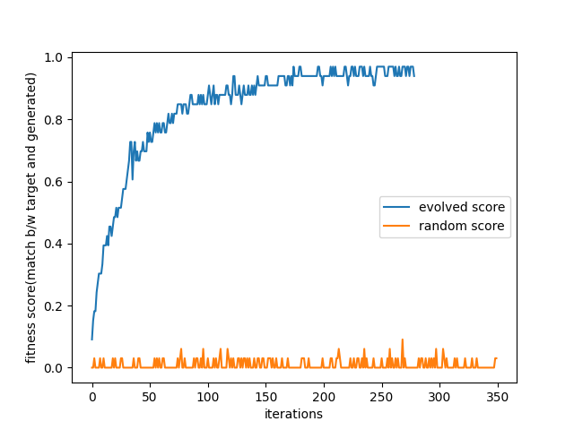

# String Generator

This is PoC on [genetic algorithm](https://natureofcode.com/genetic-algorithms/) as explained by [Daniel Shiffman](https://github.com/shiffman) in the book Nature of Code.

install optional dependency to see the difference in fitness score b/w evolutionary approach and random approach

```bash
python3 -m venv venv
./venv/bin/pip install -r optional-requirements.txt
./venv/bin/python main.py
```

<p align='center'>
    
</p>